# FoodHub 🍔🍕

Full-stack online food ordering system built with Flask, SQLAlchemy, and JavaScript.

## Features
- User authentication with role-based access (Customer, Restaurant Admin, Super Admin)
- Restaurant-wise menu browsing with filters
- Cart management and checkout
- Coupon and discount system
- Live order tracking with status timeline
- Admin dashboard for orders and revenue
- Reviews and ratings system

## Tech Stack
- Backend: Flask, SQLAlchemy
- Frontend: HTML, CSS, JavaScript
- Database: SQLite
- Authentication: Flask-Login

## How to Run Locally
```bash
pip install -r requirements.txt
python app.py

## Screenshots

### Home Page
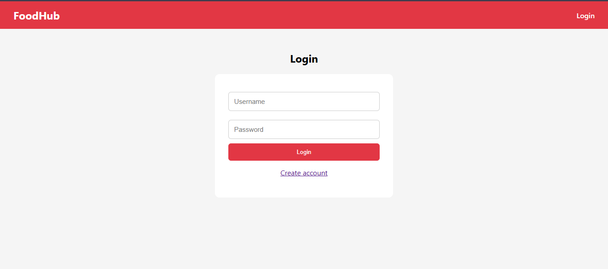

### Login Page
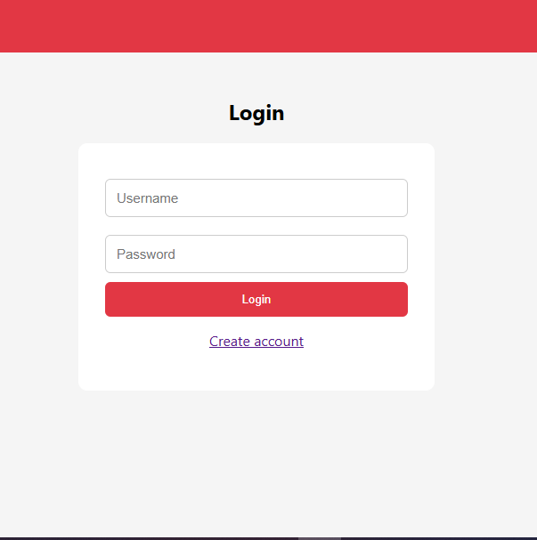

### Register Page
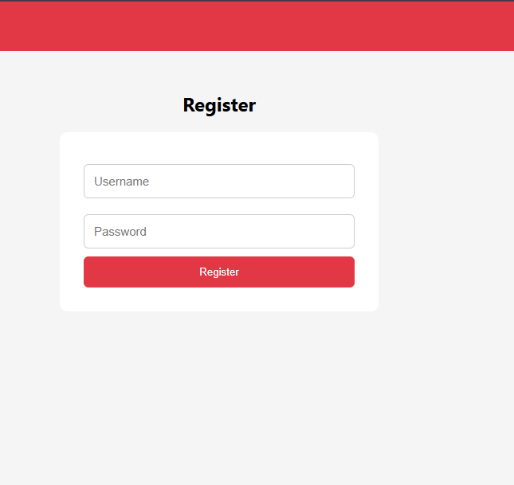

### Menu Page
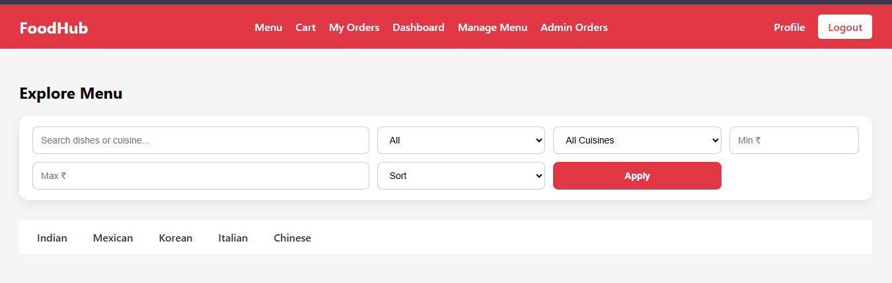

### Cart Page
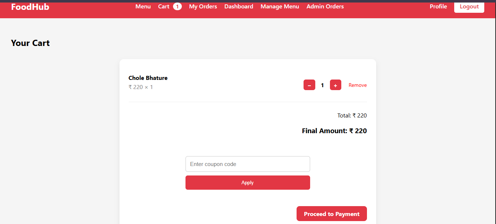

### Order Page
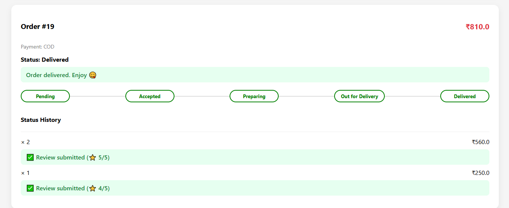

### Order Details
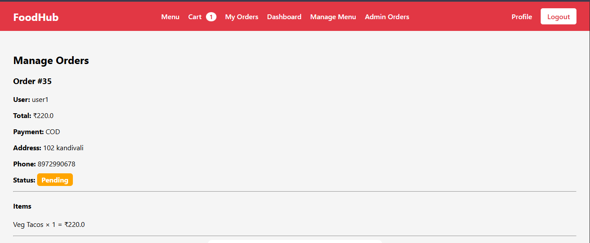

### Payment Page


### Online Payment
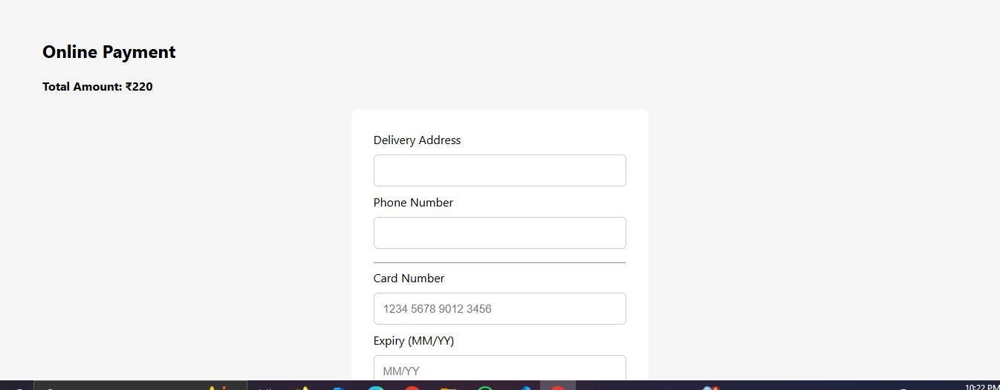

### User Profile
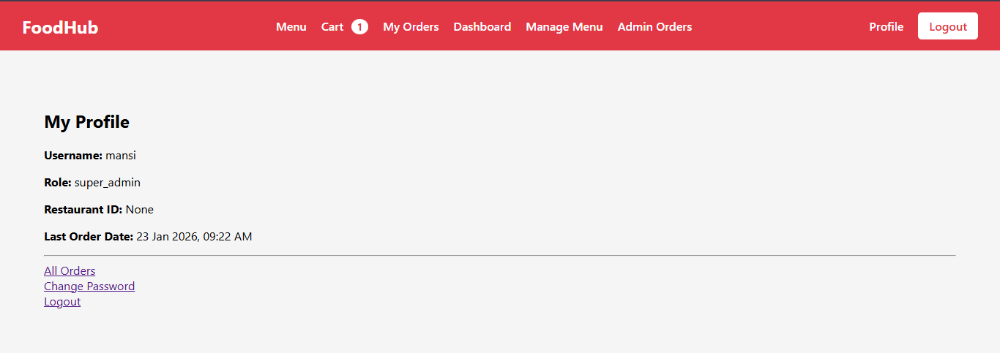

### Change Password
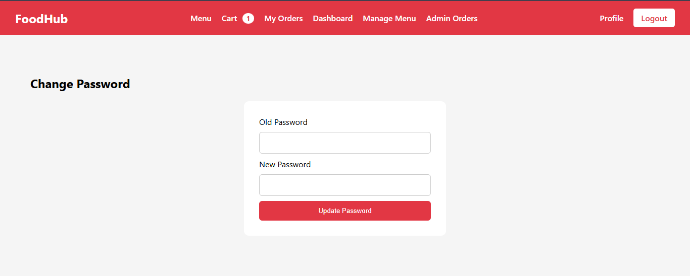

### Admin Dashboard
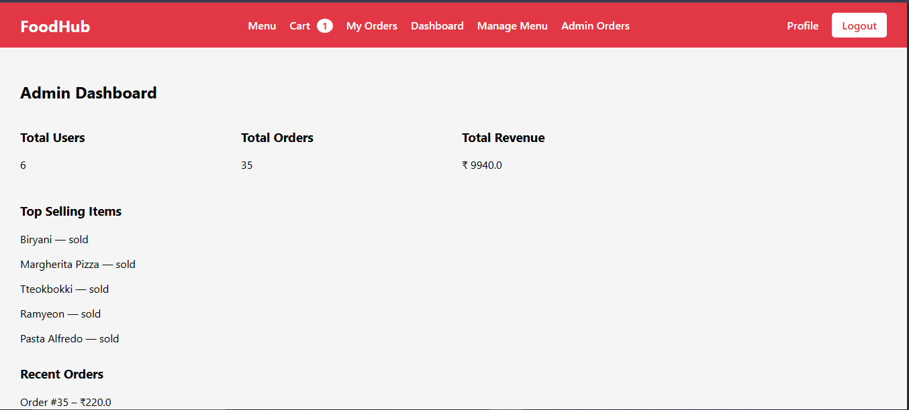

### Admin Panel
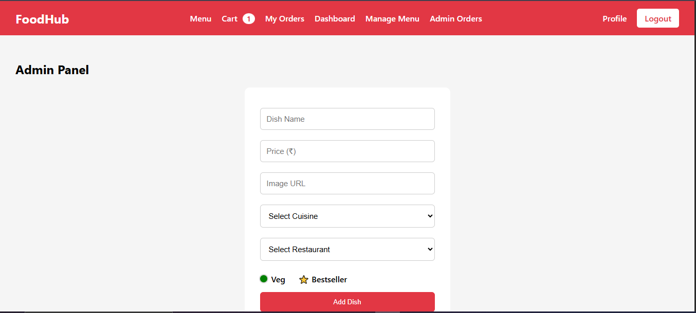
